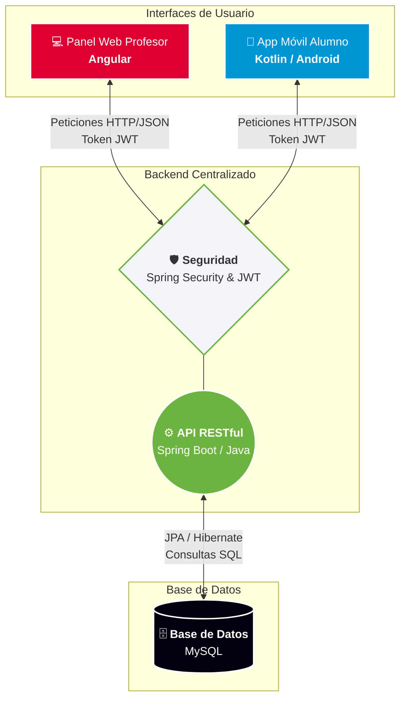

# 🎓 PocketTest: Ecosistema Educativo Inteligente

> Plataforma de evaluación académica respaldada por una API RESTful robusta que analiza el rendimiento del alumno y automatiza la generación de repasos personalizados.

---

## 📺 Demostración de funcionamiento

  <video src="./pocketTest_demo.mp4" width="650" autoplay loop muted playsinline></video>

---

## ⚙️ Arquitectura central y Backend

El núcleo de PocketTest es una **API RESTful** estructurada en **Java 17** con **Spring Boot**. El diseño lógico se ha implementado siguiendo minuciosamente las directrices de **Clean Code y los principios SOLID**, garantizando un software con alta cohesión, desacoplado y completamente mantenible.

### 🔐 Seguridad y control de acceso
* **Spring Security:** Configuración e implementación nativa en el servidor para el blindaje absoluto de los endpoints de la API.
* **Autenticación Stateless (JWT):** Control de sesiones y transmisiones de datos seguras sin estado mediante tokens cifrados firmados con algoritmos HMAC-SHA.
* **Control de Acceso Basado en Roles (RBAC):** Filtros personalizados para la restricción rigurosa de rutas según el perfil de usuario autenticado (**Administrador, Profesor o Alumno**).

### 🗄️ Modelado y persistencia de datos
* **MySQL:** Base de datos relacional normalizada y estructurada para mantener la trazabilidad completa del flujo académico (`users`, `classrooms`, `exams`, `questions`, `options`, `attempts`).
* **Manejo eficiente de relaciones N:M:** Modelado de la entidad intermedia `exam_questions` utilizando JPA/Hibernate para personalizar de forma dinámica el peso y el orden de los reactivos dentro de cada examen.

### 🧠 Algoritmo de repaso inteligente
Toda la lógica de negocio pesada reside de manera exclusiva en el servidor, mitigando vulnerabilidades en el cliente. Cuando un alumno solicita generar un repaso de refuerzo, el backend:
1. Rastrea el histórico de ejecuciones en la base de datos filtrando por el identificador del alumno.
2. Identifica y aísla de forma automática las respuestas erróneas (`is_correct = false`).
3. Instancia y persiste dinámicamente un nuevo objeto de examen de tipo `REVIEW`, dejándolo expuesto únicamente para el perfil del alumno propietario.

---

## 🏗️ Diagrama de arquitectura (Ecosistema)

Este diagrama se renderiza de manera nativa en GitHub mediante **Mermaid.js**, ilustrando el patrón de **"Un cerebro centralizado, múltiples interfaces cliente"**:

---

## 📱 Integración de clientes (Frontend)

Para verificar y validar la interoperabilidad de la API REST, el sistema abastece en tiempo real a dos tipos de arquitecturas cliente ligeras:

* **Panel Administrativo Web (Angular):** Single Page Application construida de forma **autodidacta** fuera del currículo oficial del ciclo formativo. Cuenta con internacionalización completa (i18n), protección de navegación mediante *Guards*, manipulación de formularios reactivos dinámicos y paneles analíticos para el seguimiento del rendimiento de las calificaciones de las aulas.
* **Aplicación Móvil Nativa (Kotlin):** Cliente Android enfocado en brindar una experiencia de usuario fluida, optimizado para la ejecución asíncrona de simulacros cronometrados y el consumo directo del API para renderizar las correcciones automáticas.

---

## 👨‍💻 Sobre el desarrollo

Este proyecto ha sido desarrollado en su totalidad por **Jovanna Rojas** como proyecto final integrador de la titulación de Desarrollo de Aplicaciones Multiplataforma (DAM).

El objetivo principal ha sido consolidar conocimientos técnicos avanzados en el **desarrollo Backend corporativo**, demostrando versatilidad técnica y una alta capacidad de autoaprendizaje al integrar frameworks robustos de la industria de producción actual.

---

## 📬 Contacto y redes

Si deseas conocer más detalles técnicos sobre el diseño del sistema o conectar profesionalmente:

* **LinkedIn:** www.linkedin.com/in/jovannarojasm
* **Email:** jovrojmal@outlook.es
